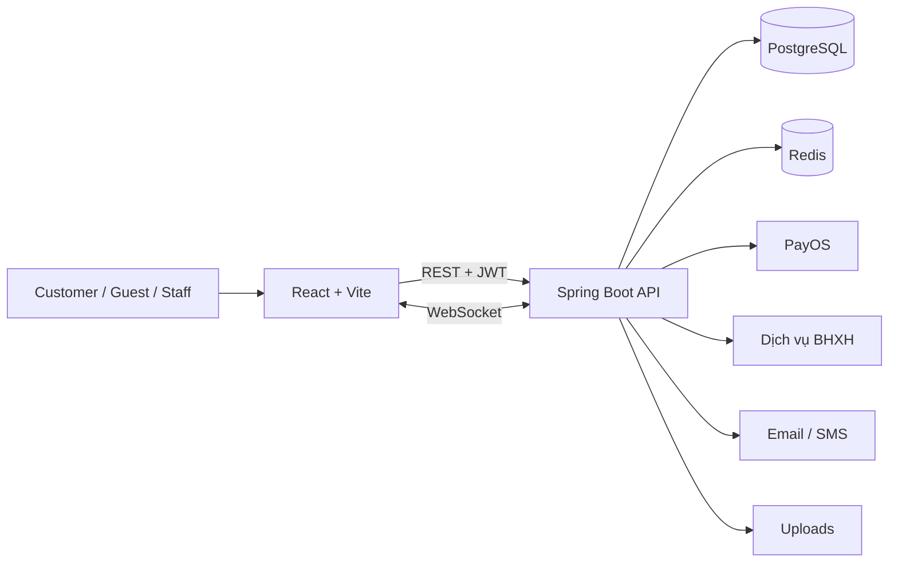
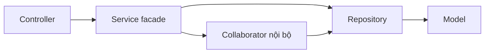

# Kiến trúc hệ thống

## Sơ đồ tổng quan

## Backend

Backend giữ kiến trúc theo tầng để hạn chế thay đổi package công khai:

- `controller`: HTTP, xác thực đầu vào và response.
- `service`: transaction và quy tắc nghiệp vụ.
- `repository`: truy cập dữ liệu JPA.
- `dto`: request/response chia theo domain.
- `model`: entity; không thay đổi nếu không có yêu cầu schema rõ ràng.
- `enums`: trạng thái và loại nghiệp vụ.
- `config`, `aop`, `exception`, `common`: hạ tầng dùng chung.

Service public là facade nghiệp vụ. Khi cần tách file lớn, collaborator nội bộ được thêm phía sau facade; controller và transaction boundary không đổi.

## Frontend

Frontend nằm trong repository riêng:

- `pages/<role>`: route container theo vai trò.
- `components`: UI dùng chung theo nhóm.
- `hooks`: điều phối state và gọi API.
- `services`: client cho API dùng chung.
- `features/<domain>`: phần được tách dần từ page lớn, không phải route mới.
- `src/locales`: nguồn bản dịch duy nhất.

Route được lazy-load trong `App.jsx`. `ProtectedRoute` là lớp bảo vệ giao diện; backend vẫn phải kiểm tra quyền độc lập.

## Nguyên tắc phụ thuộc

- Controller không truy cập repository trực tiếp.
- Entity không phụ thuộc controller hoặc DTO.
- Frontend không tự tính giá, ưu tiên hàng chờ hoặc trạng thái cuối; backend là nguồn quyết định.
