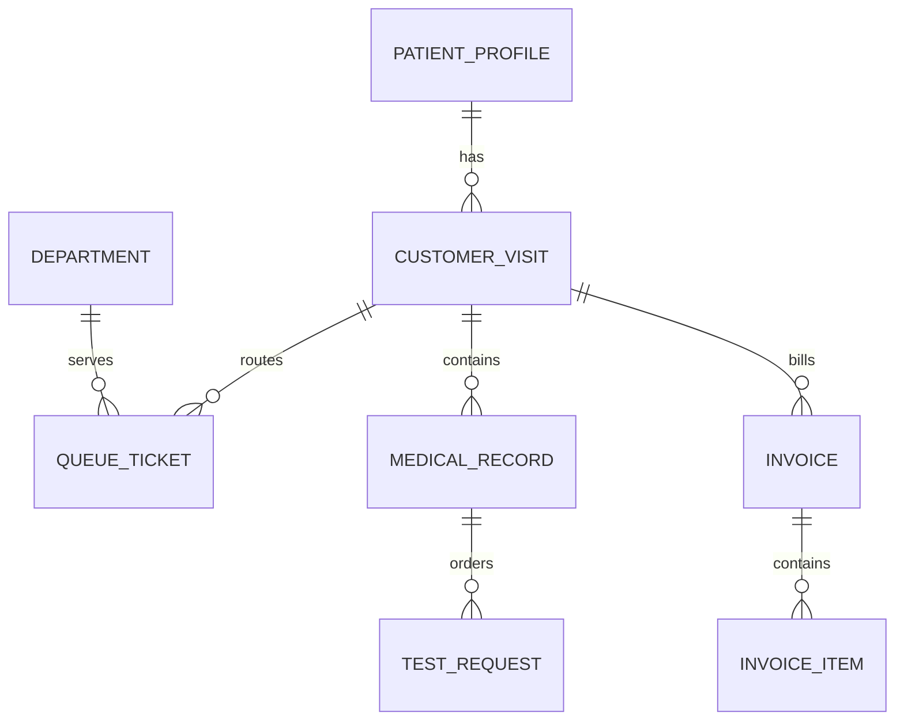

# Domain và dữ liệu

## Các miền chính

| Miền | Đối tượng trung tâm | Trách nhiệm |
|---|---|---|
| Tài khoản | Account, Staff, PatientProfile | Danh tính, vai trò, hồ sơ |
| Đặt lịch | Appointment, ShiftVersion | Dịch vụ và thời gian dự kiến |
| Lượt khám | CustomerVisit, QueueTicket | Điều phối toàn bộ lần đến khám |
| Khám bệnh | MedicalRecord, VitalSigns | Bệnh án riêng theo dịch vụ khám |
| Cận lâm sàng | TestRequest, TestResult | Chỉ định, mẫu và kết quả |
| Thanh toán | Invoice, InvoiceItem, Transaction | Giá, BHYT, thanh toán |
| CareS | MembershipCard, MembershipCardLedger | Số dư và quyền lợi thẻ |
| Vận hành | Department, StaffSchedule | Phòng, năng lực và lịch trực |

## Quan hệ nghiệp vụ cốt lõi

- `CustomerVisit` là vỏ của một lượt; không trộn dữ liệu chuyên môn của các dịch vụ.
- Mỗi dịch vụ khám có `MedicalRecord` riêng.
- CLS cùng phòng có thể dùng chung lượt gọi nhưng kết quả vẫn tách theo yêu cầu đã thanh toán.
- Invoice và lịch sử ledger là nguồn đối soát tài chính; không suy ra lại số tiền từ giao diện.

ERD đầy đủ nằm trong `docs/diagrams`. `database-schema.sql` chỉ là tài liệu tham khảo; entity và cấu hình triển khai mới là nguồn thực thi.
