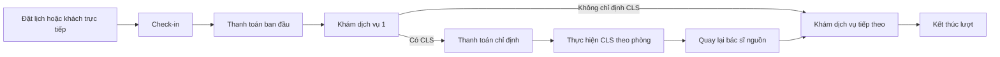

# Luồng nghiệp vụ chính

## Lượt khám

- Dịch vụ khám luôn có bệnh án riêng và thực hiện tuần tự.
- CLS đặt trước chưa làm được gom vào đợt CLS đầu tiên do bác sĩ chỉ định; nếu không có chỉ định, chúng thực hiện sau các khám ban đầu.
- Bước tiếp theo chỉ được mở khi bước trước thực sự hoàn thành.

## Qua ngày

- `WAITING`, `CALLED`, `BLOCKED` chưa phát sinh chuyên môn chuyển `SKIPPED`.
- `IN_PROGRESS`, `WAITING_FOR_TEST`, `TEST_DONE` được giữ để nhân viên xử lý tồn đọng.
- Không tự hoàn thành bệnh án, ký kết quả hoặc hoàn tiền.

## Hàng chờ

- Giữ người đang được gọi/đang phục vụ.
- Khách quay lại sau CLS và khách đã được xác nhận quay lại được xếp theo quy tắc ưu tiên hiện hành.
- Sau người đầu FIFO và các trường hợp quay lại có ưu tiên nghiệp vụ, khách có lịch đúng giờ được xếp liên tục trước khách trực tiếp; số phiếu không đồng nghĩa vị trí hiện tại.

## Xét nghiệm và thanh toán

- Chọn gói/chỉ số được backend chuẩn hóa trước khi lập hóa đơn.
- Kỹ thuật viên chỉ nhập chỉ số đã thanh toán; chỉ số chưa mua được khóa.
- Kết quả chỉ công bố khi hoàn thành/ký theo quy tắc hiện hành.
- CareS, BHYT và giao dịch được trình bày tách biệt trên hóa đơn và phiếu thu.
